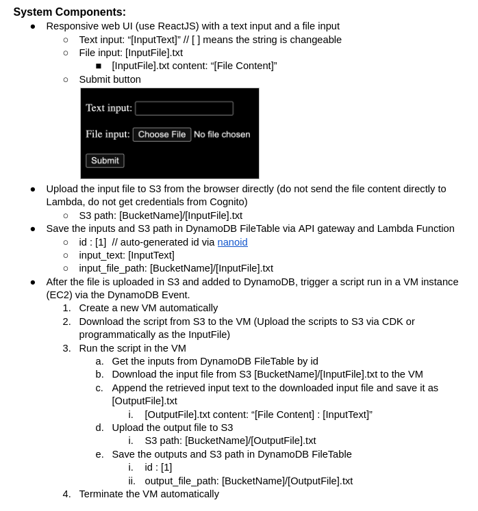

# Fovus Coding Challenge




## IAM Policies
Attach the following policies to group and placed user in group:
DynamobDB:
    - ListTables 
    - GetItem
    - PutItem
S3:
    - ListAllMyBuckets
    - ListBucket
    - GetObject
    - PutObject

## Policy to start and stop VM
[AWS Resource](https://www.youtube.com/watch?v=tniZDP4PDz0)

```json
{
  "Version": "2012-10-17",
  "Statement": [
    {
      "Effect": "Allow",
      "Action": [
        "logs:CreateLogGroup",
        "logs:CreateLogStream",
        "logs:PutLogEvents"
      ],
      "Resource": "arn:aws:logs:*:*:*"
    },
    {
      "Effect": "Allow",
      "Action": [
        "ec2:Start*",
        "ec2:Stop*"
      ],
      "Resource": "*"
    }
  ]
}
```
## EC2 Start/Stop
[Start Stop](https://docs.aws.amazon.com/sdk-for-javascript/v3/developer-guide/javascript_ec2_code_examples.html)

```javascript
// Stop EC2 instances

import { EC2Client, StopInstancesCommand } from "@aws-sdk/client-ec2";

const client = new EC2Client({ region: REGION });

export const handler = async () => {
  const command = new StopInstancesCommand({
    // Use DescribeInstancesCommand to find InstanceIds
    InstanceIds: ["INSTANCE_ID"],
  });

  try {
    const { StoppingInstances } = await client.send(command);
    const instanceIdList = StoppingInstances.map(
      (instance) => ` • ${instance.InstanceId}`,
    );
    console.log("Stopping instances:");
    console.log(instanceIdList.join("\n"));
  } catch (err) {
    console.error(err);
  }
};
```

```javascript
// Start EC2 instances
import { EC2Client, StartInstancesCommand } from "@aws-sdk/client-ec2";

const client = new EC2Client({ region: REGION });

export const handler = async () => {
  const command = new StartInstancesCommand({
    // Use DescribeInstancesCommand to find InstanceIds
    InstanceIds: ["INSTANCE_ID"],
  });

  try {
    const { StartingInstances } = await client.send(command);
    const instanceIdList = StartingInstances.map(
      (instance) => ` • ${instance.InstanceId}`,
    );
    console.log("Starting instances:");
    console.log(instanceIdList.join("\n"));
  } catch (err) {
    console.error(err);
  }
};


```

## S3 Bucket Key Information 
[Bucket Key](https://docs.aws.amazon.com/AmazonS3/latest/userguide/bucket-key.html?icmpid=docs_amazons3_console)

## Upload Files to S3 Bucket

[AWS-SDK V3](https://aws.amazon.com/blogs/developer/why-and-how-you-should-use-aws-sdk-for-javascript-v3-on-node-js-18/)
[S3 SDK](https://docs.aws.amazon.com/sdk-for-javascript/v3/developer-guide/javascript_s3_code_examples.html)

```javascript
import { PutObjectCommand, S3Client } from "@aws-sdk/client-s3";

const client = new S3Client({});

export const main = async () => {
  const command = new PutObjectCommand({
    Bucket: "test-bucket",
    Key: "hello-s3.txt",
    Body: "Hello S3!",
  });

  try {
    const response = await client.send(command);
    console.log(response);
  } catch (err) {
    console.error(err);
  }
};
```

## Lambda Setup
[lambda](https://docs.aws.amazon.com/apigateway/latest/developerguide/getting-started.html#getting-started-create-function)
[http-api example](https://docs.aws.amazon.com/apigateway/latest/developerguide/http-api-dynamo-db.html)

[API Headers](https://docs.aws.amazon.com/apigateway/latest/developerguide/http-api-cors.html)

To send to DynamoDB, create lambda function: `send_to_dynamo`:

```javascript
import { DynamoDBClient } from "@aws-sdk/client-dynamodb";
import {
  DynamoDBDocumentClient,
  PutCommand,
} from "@aws-sdk/lib-dynamodb";

const client = new DynamoDBClient({
    credentials: {
        accessKeyId: process.env.REACT_APP_ACCESSKEYID,
        secretAccessKey: process.env.REACT_APP_SECRETACCESSKEY,
    },
    region: process.env.REACT_APP_REGION
});

const dynamo = DynamoDBDocumentClient.from(client);


export const handler = async (event, context) => {
  let body;
  let statusCode = 200;
  const headers = {
    "Content-Type": "application/json",
  };

  try {
    switch (event.routeKey) {
      case "POST /send_to_dynamo":
        let requestJSON = JSON.parse(event.body);
        await dynamo.send(
          new PutCommand({
            TableName: process.env.REACT_APP_FILETABLENAME,
            Item: {
              id: requestJSON.id,
              input_text: requestJSON.input_text,
              input_file_path: requestJSON.input_file_path,
            },
          })
        );
        body = `Post FileTable item ${requestJSON.id}`;
        break;
      default:
        throw new Error(`Unsupported route: "${event.routeKey}"`);
    }
  } catch (err) {
    statusCode = 400;
    body = err.message;
  } finally {
    body = JSON.stringify(body);
  }

  return {
    statusCode,
    body,
    headers,
  };
};
```

## DynamoDB SDK 
[DynamoDB SDK](https://docs.aws.amazon.com/sdk-for-javascript/v3/developer-guide/javascript_dynamodb_code_examples.html)
```javascript
import { ListTablesCommand, DynamoDBClient } from "@aws-sdk/client-dynamodb";

const client = new DynamoDBClient({});

export const main = async () => {
  const command = new ListTablesCommand({});

  const response = await client.send(command);
  console.log(response.TableNames.join("\n"));
  return response;
};
```
```javascript
import { DynamoDBClient } from "@aws-sdk/client-dynamodb";
import { PutCommand, DynamoDBDocumentClient } from "@aws-sdk/lib-dynamodb";

const client = new DynamoDBClient({});
const docClient = DynamoDBDocumentClient.from(client);

export const main = async () => {
  const command = new PutCommand({
    TableName: "HappyAnimals",
    Item: {
      CommonName: "Shiba Inu",
    },
  });

  const response = await docClient.send(command);
  console.log(response);
  return response;
};
```

